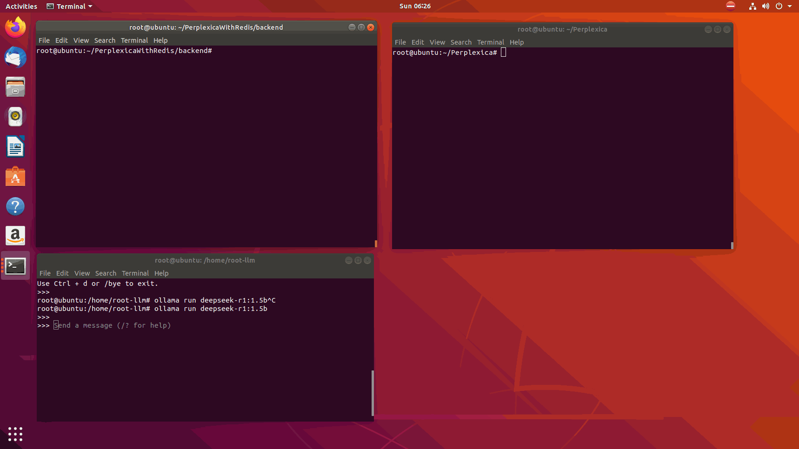

# Perplexica 后端服务

这是一个基于 Flask 的后端服务，为 Perplexica 提供搜索和 AI 对话功能，包含 Redis 缓存支持。

## 功能特点

- 支持 Ollama 模型调用
- 支持 SearxNG 搜索集成
- Redis 缓存支持
- 自动模型选择机制
- 详细的日志记录
- 健康状态检查

## 结果展示



## 环境要求

- Python 3.8+
- Redis 服务器
- Ollama 服务（可选）
- SearxNG 服务（可选）

## 安装

1. 克隆仓库：
```bash
git clone https://github.com/W1nTer126/PerplexicaWithRedis.git
cd Perplexica/backend
```

2. 安装依赖：
```bash
pip install -r requirements.txt
```

3. 配置环境变量：
创建 `.env` 文件并设置以下变量：
```env
REDIS_HOST=localhost
REDIS_PORT=6379
```

4. 配置 Perplexica：
在项目根目录的 `config.toml` 文件中配置服务：
```toml
[API_ENDPOINTS]
SEARXNG = "http://localhost:8888"  # 可选，SearxNG 服务地址

[MODELS.OLLAMA]
API_URL = "http://localhost:11434"  # Ollama 服务地址
DEFAULT_MODEL = "deepseek-r1:1.5b"  # 默认使用的模型
```

## 运行

1. 启动服务：
```bash
python app.py
```

服务将在 http://localhost:5000 上运行。

## API 文档

### 1. 聊天接口

**端点**: `/api/chat`

**方法**: POST

**请求体**:
```json
{
    "query": "你的问题",
    "model": "模型名称"  // 可选，不指定则使用默认模型
}
```

**响应**:
```json
{
    "message": "AI 的回复",
    "sources": [
        {
            "title": "来源标题",
            "url": "来源URL",
            "content": "来源内容"
        }
    ],
    "model": "使用的模型名称"
}
```

**错误响应**:
```json
{
    "error": "错误信息",
    "status": "错误状态码",
    "details": "详细错误信息"  // 可选
}
```

### 2. 状态检查接口

**端点**: `/api/status`

**方法**: GET

**响应**:
```json
{
    "ollama_available": true,
    "redis_available": true,
    "searxng_available": false,
    "ollama_url": "http://localhost:11434",
    "default_model": "deepseek-r1:1.5b",
    "available_models": ["llama2", "mistral", "codellama"]
}
```

## 模型支持

服务支持以下模型（需要预先下载）：

- llama2
- mistral
- codellama
- neural-chat
- deepseek-r1:1.5b
- 其他已下载的 Ollama 模型

## 缓存机制

- 使用 Redis 缓存查询结果
- 缓存过期时间为 5 分钟
- 缓存键包含查询内容和使用的模型

## 错误处理

服务提供详细的错误信息，包括：
- 服务不可用状态
- 模型未下载提示
- 连接错误信息
- 请求失败详情

## 日志记录

服务记录以下信息：
- 服务启动和连接状态
- 缓存命中/未命中情况
- 模型选择和使用情况
- 错误和异常信息

## 使用示例

1. 基本查询：
```bash
curl -X POST http://localhost:5000/api/chat \
  -H "Content-Type: application/json" \
  -d '{"query": "什么是人工智能？"}'
```

2. 指定模型：
```bash
curl -X POST http://localhost:5000/api/chat \
  -H "Content-Type: application/json" \
  -d '{"query": "什么是人工智能？", "model": "mistral"}'
```

3. 检查服务状态：
```bash
curl http://localhost:5000/api/status
```

## 注意事项

1. 确保 Redis 服务已启动并可访问
2. 如果使用 Ollama，确保已下载所需模型
3. 如果使用 SearxNG，确保服务地址配置正确
4. 建议在生产环境中使用 gunicorn 或 uwsgi 运行服务

## 许可证

Apache License 2.0

Copyright 2025 Ouzhaodong

Licensed under the Apache License, Version 2.0 (the "License");
you may not use this file except in compliance with the License.
You may obtain a copy of the License at

    http://www.apache.org/licenses/LICENSE-2.0

Unless required by applicable law or agreed to in writing, software
distributed under the License is distributed on an "AS IS" BASIS,
WITHOUT WARRANTIES OR CONDITIONS OF ANY KIND, either express or implied.
See the License for the specific language governing permissions and
limitations under the License. 